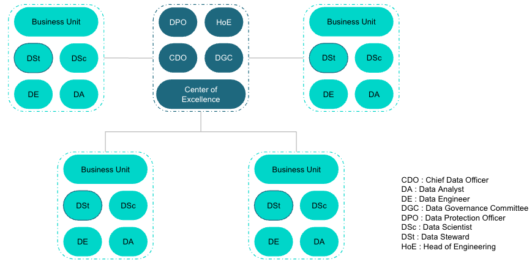
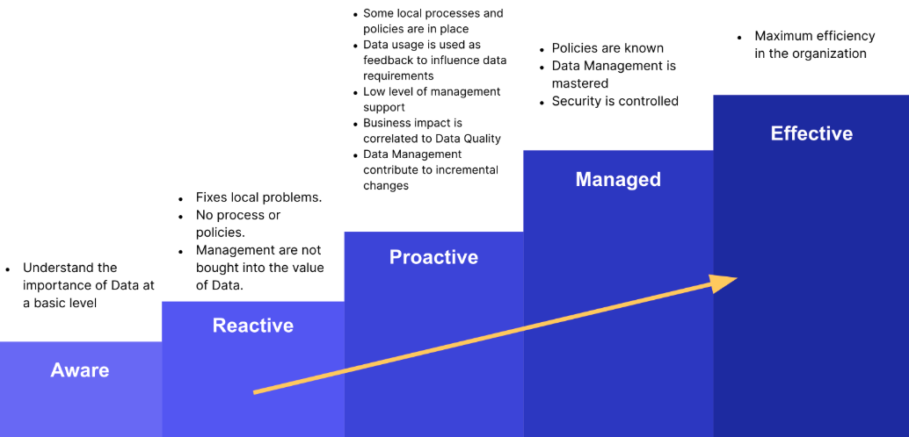
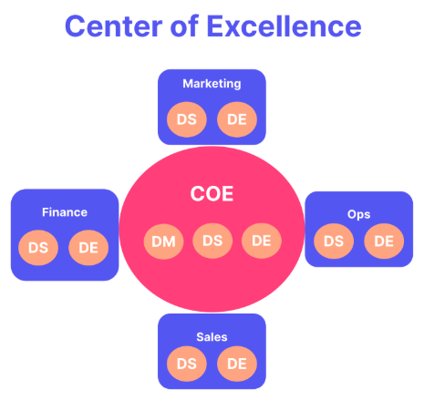

# Plan de gouvernance Spotify

[Cas d'étude](business_case.pdf)

## Évaluation de la maturité des données et de la gouvernance

Pour établir un plan de gouvernance, il convient de commencer par un état des lieux de l’existant. L’idée est d’identifier les points forts et faibles de l'organisation en place, afin de pouvoir dresser une liste de défis de gouvernance auxquels devra faire face Spotify pour évoluer.

### Niveau actuel de maturité des données

Pour se faire, chaque composante relative à la gestion au sens large des données a été analysée, en voici en substance les points forts et faibles :

**Gouvernance :** Spotify dispose d’une vision claire et des rôles bien définis (Chief Data Officer, marketing, ingénierie, etc.). Pour autant, la gouvernance reste décentralisée, notamment causée par les silos de données entre départements.

**Qualité :** La qualité des données est reconnue comme critique, notamment pour le moteur de recommandation. Cependant, l’absence de standards unifiés entraîne des incohérences et des doublons.

**Architecture :** Spotify possède une infrastructure avancée (data lakes, cloud, traitement en temps réel) mais souffre d’un manque d’intégration transversale.

**Conformité :** L'identification des obligations (RGPD, CCPA, etc.) est bien présente, avec un Data Protection Officer (DPO) nommé. Cependant, les procédures demeurent segmentées et non uniformisées.

**Accessibilité et usage :** Les équipes utilisent les données de manière pertinente, mais leur segmentation rend difficile la vision complète du parcours utilisateur.

**Sécurité :** La sécurité est identifiée comme prioritaire, mais les mécanismes de contrôle (audits, MFA, RBAC) ne sont pas encore pleinement définis et déployés.

**Littératie :** La culture data-driven est forte, mais manque de formations uniformisées sur la gouvernance et la qualité.

**Analyse et BI :** Spotify performe dans l’utilisation de l’IA et du machine learning (recommandations personnalisées), mais les analyses restent cantonnés aux silos métiers.
D’un point de vue maturité, Spotify se situe donc entre le stade de réactivité et de proactivité (***ANNEXE 1***), cela se matérialise par une organisation technologique mature mais encore perfectible en matière de gouvernance et de standardisation.

### Principaux défis de gouvernance des données

Malgré son infrastructure avancée et sa bonne exploitation de la donnée, Spotify doit faire face à 6 défis majeurs :

1. **Silos de données et fragmentation**
    - Les départements (marketing, produit, ingénierie, etc.) gèrent leurs données indépendamment.
    - Conséquences : difficultés à reconstituer le parcours complet d’un utilisateur, duplication des efforts, vision incomplète pour des analyses globales.

2. **Conformité réglementaire complexe**
    - Spotify évolue dans un paysage réglementaire international (RGPD, CCPA, etc.).
    - Le manque de processus unifiés et de reporting standardisés expose l’entreprise à des risques juridiques et financiers (jusqu’à 4 % du CA mondial en cas de non-conformité).

3. **Qualité et fiabilité des données**
    - Les recommandations et l'efficacité des campagnes marketing sont directement impactées par les défaillances dans la collecte et la mise à jour des données.
    - En l'absence de standardisation, les erreurs liées à la qualité risquent de nuire aux prises de décision stratégiques.

4. **Sécurité et protection de la vie privée**
    - Les contrôles de sécurité sont encore insuffisants.
    - Nécessité d'intensifier l'anonymisation, la minimisation des données et la gestion des consentements afin de préserver la confiance des utilisateurs et pondérer les risques en cas de fuite de données.

5. **Accessibilité et intégration des données**
    - L’absence de datahub unifié empêche une collaboration fluide inter-départements et par conséquent, ralentit l’innovation produit.
    - Les projets nécessitant des données transversales, par exemple le lancement de nouvelles fonctionnalités, souffrent de retards.

6. **Culture et gouvernance partagée**
    - Si la culture axée sur les données est bien ancrée, la compréhension des problématiques de gouvernance varie selon les équipes.
    - Pour accroître la maturité organisationnelle, il est indispensable de dispenser des formations et d'adopter des normes communes.

### Conclusion et perspectives

Spotify est techniquement avancé, mais organisationnellement divisé. Afin de passer à un niveau supérieur de maturité, l'entreprise doit :
- Mettre en place un cadre de gouvernance centralisé, de type Center of Excellence (**ANNEXE 2**).
- Uniformiser les procédures de qualité, de sécurité et de conformité à l'échelle internationale.
- Déployer un datahub unifié pour casser les silos et fluidifier l’accès aux données.
- Renforcer la formation et la culture commune en matière de gouvernance.

## Politique de gouvernance des données

Dans la suite, seront définis les principes clés, les exigences réglementaires et les rôles organisationnels qui permettront une gestion responsable des données chez Spotify.

### Principes Clés de la Gouvernance des Données

La stratégie de gestion des données de Spotify s'appuie sur une série de principes de base pour faire face à la complexité inhérente à la gestion des données à l'échelle mondiale et au respect des lois :

**Responsabilité**

Spotify attribue une responsabilité claire à chaque processus lié aux données. Les Data Stewards supervisent la gestion des données au sein des départements, tandis que le Data Protection Officer (DPO) veille à ce que les normes légales et éthiques soient respectées dans toute l’organisation. Ainsi, chaque donnée à un détenteur chargé de garantir son intégrité et sa conformité.

**Transparence**

Les actions de gestion des données doivent être effectuées de manière claire et ouverte pour les utilisateurs ainsi que les parties prenantes. Spotify fournit une communication transparente concernant la collecte, le stockage, le partage et le traitement des données. Conformément au RGPD et au CCPA, des politiques de confidentialité et des processus de consentement sont appliqués.

**Sécurité des Données**

Il est essentiel de garantir la sécurité des données tant pour les utilisateurs que pour la société. Les données sensibles (informations personnelles et de paiement) sont sécurisées via le chiffrement, des contrôles d'accès et des protocoles de gestion des incidents sont mis en place, afin de répondre aux critères PCI-DSS et aux standards internationaux.

**Qualité des Données**

Dans le but d'assurer l'exactitude, l'exhaustivité et la fiabilité des données, Spotify réalise fréquemment des audits. Des indicateurs de qualité sont établis et des évaluations régulières sont effectuées pour assurer que les données appuient de manière efficace l'activité et l'expérience utilisateur.

**Conformité**

Toutes les manipulations de données se font en conformité avec des régulations internationales comme le RGPD, le CCPA et la norme PCI-DSS. Des évaluations de conformité périodiques permettent de suivre les changements des obligations juridiques et garantissent une gestion légale des données.

**Minimisation des Données**

Spotify ne collecte et n'utilise que les données indispensables pour des objectifs commerciaux précis, minimisant de ce fait les risques de fuite tout en diminuant les dépenses de stockage et en respectant la législation.

**Droits des Utilisateurs**

Les utilisateurs ont la possibilité d'accéder à leurs données, de les modifier ou de les supprimer, et peuvent facilement s'opposer à la vente ou au partage de leurs informations personnelles en fonction des lois en vigueur. Ces droits sont assurés à chaque niveau de l'entreprise grâce à des processus intégrés.

**Amélioration Continue**

Spotify adapte en permanence ses méthodes de gouvernance des données pour suivre l'évolution technologique et les modifications réglementaires. Des évaluations régulières garantissent l'efficacité et la durabilité de la politique de gouvernance.

**Usage Éthique**

Spotify s’engage à utiliser les données de manière éthique, en suivant des directives précises pour le recours à l'intelligence artificielle et la décision automatisée, dans le but de protéger ses utilisateurs contre toute forme de biais ou de discrimination.

### Conformité au RGPD, CCPA et PCI-DSS

La gouvernance des données chez Spotify repose sur une stricte conformité aux principales régulations légales, y compris le Règlement Général sur la Protection des Données (RGPD), la loi californienne sur la protection de la vie privée des consommateurs (CCPA) et les normes PCI-DSS relatives à la sécurité des paiements.

**Exigences du RGPD**

- Traitement légal, équitable et transparent :  Les opérations de traitement de données se réalisent dans une démarche de conformité totale qui assure le respect de la loi et l'équité. Elles sont menées en toute transparence pour les utilisateurs grâce à des politiques et des mécanismes de consentement robustes.
- Droits des utilisateurs : Les utilisateurs ont la possibilité de solliciter l'accès, la modification ou l'effacement de leurs données, et profitent de procédures assurant des réponses rapides.
- Gestion du consentement : Avant tout traitement de données personnelles, un consentement explicite est recueilli.
- Signalement des infractions : Selon le RGPD, Spotify est tenu de notifier les autorités compétentes dans les 72 heures suivant une violation de données.
- Data Protection Officer : Un DPO supervise toutes les procédures liées au RGPD, agit en tant que point de contact pour les autorités et assure la documentation et la conformité lors des évaluations d'impact sur la vie privée.

**Exigences du CCPA**

- Refus de vente de données : Spotify propose à ses utilisateurs des options explicites pour s'opposer à la vente de leurs informations personnelles.
- Accès et suppression : Les utilisateurs peuvent demander la récupération ou la suppression de leurs données.
- Non-discrimination : Aucune discrimination n'est exercée envers les utilisateurs dans l'application de leurs droits selon le CCPA.

**Exigences de PCI-DSS**

- Sécurité des réseaux : Sont mis en place des infrastructures avec pare-feu et politiques de sécurité pour protéger les données personnelles et de paiement. Cette responsabilité incombe au responsable technique (Head of Engineering). 
- Accès réglementé : Seul le personnel habilité peut consulter les données sensibles.
- Contrôles et tests fréquents : Une surveillance et des audits réguliers sont réalisés  pour éviter les failles de sécurité.
- Politique de sécurité : Une politique globale et actualisée sur la sécurité de l’information est intégrée à la gouvernance des données.

### Rôles et Responsabilités

Afin d'assurer une gouvernance efficace, Spotify établit et précise clairement les rôles principaux suivants :

**Data Steward (DSt)**

- Veiller à la gestion des données au sein des différents départements, assurer la qualité (exactitude, cohérence, fiabilité), appliquer la politique de gouvernance et superviser les accès.
- Travailler en collaboration avec les équipes techniques et être le premier point de contact pour toute question liée aux données de son domaine d'expertise.

**Data Protection Officer (DPO)**

- Veiller au respect des lois de protection des données, relais avec les instances réglementaires, assistance lors des analyses d'impact et gestion des incidents.
- Surveillance organisationnelle en matière de protection et de confidentialité des données conformément au RGPD et au CCPA.

**Chief Data Officer (CDO)**

- Définir la stratégie globale de gestion des données, élaborer des politiques de gouvernance, collaborer avec la direction pour promouvoir l’utilisation des données et ce, dans le respect de la réglementation.
- Coordination stratégique, élaboration des politiques et encouragement d'une culture axée sur les données.

**Data Governance Committee (DGC)**

- Garantir la cohérence des politiques entre les différents départements, valider les processus, traiter les enjeux inter-départements et assurer le respect des normes.
- Surveillance de la stratégie et évaluation des principales initiatives de gouvernance.

**Head of Engineering (HoE)**

- Définir les solutions techniques d’infrastructure, de qualité et d'intégration des données en alignement avec la stratégie globale.
- Surveillance et maintien de la sécurité des systèmes de données.

Ces nouveaux rôles viennent s’ajouter à ceux existants : Data Analyst, Data Engineer et Data Scientist.

Organigramme projeté sur le modèle Center of Excellence :

## Mise en œuvre de la gouvernance des données : Modèle « Center of Excellence »

Actuellement, Spotify utilise un modèle d'organisation intégrée (embedded), ayant comme désavantage un manque de source de données unique et avec comme conséquence des silos. La mise en œuvre d’une gouvernance des données, en se basant sur le modèle organisationnel du « Center of Excellence » (CoE), induira l’introduction de nouveaux outils techniques et d’une phase pilote, portée sur le département Marketing.

### Recommandation d’outils techniques

| Composante | Outil recommandé | Raisons |
|:-|:-|:-| 
| Catalogage des données | Collibra | Gouvernance, catalogage et gestion complète des données à grande échelle. |
| Qualité des données | Ataccama ONE | Profilage, nettoyage et gouvernance des données automatisés par l'intelligence artificielle. |
| Suivi de conformité | OneTrust | Automatisation RGPD / CCPA, cartographie, évaluation des risques et reporting. |
| Sécurité des données | Splunk | Supervision en temps réel des incidents et risques de sécurité. |

### Phase pilote : département Marketing

Le projet pilote vise à évaluer l’efficacité de la gouvernance des données, afin de détecter les défis, améliorer les processus et préparer son déploiement global.

#### Objectifs

- **Gouvernance et conformité :** garantir la qualité, la sécurité et la conformité réglementaire des données (RGPD/CCPA).
- **Accessibilité et intégration :** améliorer l’accès, le partage et l’interopérabilité des données en réduisant les silos.
- **Gestion proactive des risques :** identifier et atténuer les menaces en matière de sécurité et de gouvernance.

#### Rôles clés et responsabilités

| Rôle | Responsabilités |
|:-|:-|
| Chef de projet du pilote | Supervise la mise en œuvre, coordonne avec les parties prenantes. |
| Data Protection Officer (DPO) | Garantit la conformité RGPD / CCPA et autres réglementations. |
| Head Of Engineering (HoE) | Conçoit l’architecture technique. |
| Ingénieur IT | Met en œuvre et administre les outils techniques. |
| Data Steward (Marketing) | Gère la qualité et la gouvernance locale des données. |
| Responsable département Marketing | Supervise et garantit l’alignement business. |

#### Jalons du projet 

| Ordre | Jalons | Responsable |
|:-|:-|:-|
| 1 | Réunion de lancement | Chef de projet |
| 2 | Conception de l’architecture technique | HoE |
| 3 | Évaluation/Nettoyage des données | Data Steward |
| 4 | Audit de conformité RGPD / CCPA | DPO |
| 5 | Mise en place technique / Intégration des données | Ingénieur IT |
| 6 | Revue intermédiaire et ajustements | Chef de projet |
| 7 | Formation du département Marketing | Data Steward |
| 8 | Bilan final et clôture du pilote | Chef de projet |

#### Principaux livrables

**Rapport sur la qualité des données :** rapport détaillant les améliorations apportées à la qualité des données à la suite du projet pilote.

**Évaluation de la conformité :** résumé de la conformité du département au RGPD et au CCPA.

**Plan d'intégration technique :** document décrivant comment les données ont été intégrées et rendues accessibles dans l'ensemble du département.

**Rapport d'évaluation des risques :** analyse détaillée des risques potentiels liés aux données et des stratégies d'atténuation identifiées au cours du projet pilote.

**Commentaires des parties prenantes :** compilation des commentaires des utilisateurs et des parties prenantes sur l'efficacité du cadre de gouvernance.

#### Indicateurs clés de performance (KPI)

Afin de pouvoir juger de l’efficacité du pilote, des indicateurs sont mis en place afin de quantifier et valider les améliorations.

| KPI | Définition et Objectif | Seuil de validation |
|:-|:-|:-|
| Score de qualité des données | Mesure de l’exactitude, l’exhaustivité et la cohérence des données. | Réduction de 10% des valeurs manquantes |
| Score de conformité | Suivi des actions répondant au RGPD/CCPA comme la gestion des consentements, droits d’accès, etc. | 100% des utilisateurs ont donné leur consentement au traitement des données |
| Vitesse d’accès aux données | Temps moyen nécessaire à un utilisateur autorisé pour accéder à la donnée demandée | Amélioration de 20% sur la vitesse d’accès |
| Score d’atténuation des risques | Évaluation de la gestion proactive des risques et du nombre d’incidents évités ou résolus | Réduction des violations identifiées |

#### Gestion des risques

| Risque | Probabilité | Impact | Stratégie de mitigation |
|:-|:-|:-|:-|
| Non-conformité RGPD / CCPA | Moyen | Haut | Audits réguliers du DPO, formations des équipes à la conformité |
| Résistance au changement | Haut | Moyen | Ateliers de conduite du changement, mécanismes de feedback |
| Problèmes de qualité non résolus | Bas | Moyen | Implémentation d’Ataccama ONE, suivis réguliers |
| Échec d’intégration technique | Moyen | Haut | Implication IT en amont, vérification des compatibilités |

#### Formation et conduite du changement

Afin de garantir une adoption la plus efficace, pertinente et constructive possible, des actions de formation et conduite du changement sont à envisager :
- Organisation d’ateliers pour former les équipes marketing aux nouveaux outils et processus.
- Mise à disposition de supports, tutoriels et aide en ligne.
- Instaurer un mécanisme de feedback pour remonter les besoins/questions.

#### Évaluation et mise à l'échelle

Enfin, il convient d’évaluer, tirer les enseignements et se projeter dans la mise à l'échelle :  
- Évaluer les résultats du pilote selon les indicateurs clés de performance (KPI) prédéfinis pour mesurer les améliorations.
- Recueillir les retours d’expérience des parties prenantes et des utilisateurs finaux afin d’obtenir des perspectives d’améliorations.
- Consigner les leçons apprises, en soulignant les réussites, les défis et les suggestions.
- Adapter le modèle de gouvernance des données sur la base des résultats du projet pilote et des feedbacks recueillis.
- Mettre au point un plan de déploiement pour étendre cette structure à d'autres départements.

## ANNEXE 1

**Niveau 1 :** Conscient (Aware) - Nous commençons à reconnaître l'importance des données à un niveau très fondamental. Nous savons qu'elles existent et nous commençons à les utiliser, mais de manière très basique.

**Niveau 2 :** Réactif (Reactive) - Nous partageons les données entre nous, mais nous les utilisons principalement de manière réactive, en réagissant aux situations plutôt qu'en planifiant à l'avance.

**Niveau 3 :** Proactif (Proactive) - Nous disposons d'un système de gestion de l'information et nous utilisons nos données de manière proactive pour améliorer nos produits et services.

**Niveau 4 :** Géré (Managed) - Nous maîtrisons la gestion de l'information d'entreprise (EIM). Nous connaissons nos politiques en matière de données sur le bout des doigts et nous optimisons l'utilisation et la sécurité des données.

**Niveau 5 :** Efficace (Effective) - Nous avons optimisé notre efficacité en matière de traitement et d'utilisation des données, et nous fonctionnons au mieux de nos capacités.

## ANNEXE 2

**Modèle Center of Excellence pour la gouvernance des données**

Le modèle « Center of Excellence » (CoE) offre une stratégie hybride avec  : 
- l’expertise centralisée du CoE, notamment en matière de recherche et d'innovation, de mise en œuvre d'initiatives transverses et de gouvernance organisationnelle.
- l’application décentralisée dans chaque équipe, appuyé par des relais (Data Steward) garantissant la bonne gestion des données et l’application de la politique de gouvernance.

**Structure**

- Une équipe expérimentée en data (le CoE) est chargée de superviser la gouvernance, la gestion, la qualité et l'analytique des données à travers toute l'organisation.
- Chaque département (marketing, finance, opérations, etc.) dispose de sa propre équipe dédiée, supervisée et appuyée par le CoE.
- Le CoE assure la cohérence des normes, politiques et processus à l'échelle de l'entreprise, en offrant une « source unique d'information fiable » pour les données principales et de référence, tout en favorisant la collaboration entre différents départements.

**Avantages**

- Allie la flexibilité et l'expertise des modèles « intégrés » (embedded) à la supervision stratégique d'une gouvernance centralisée.
- Favorise l’efficacité, l’innovation et des politiques unifiées à l’échelle de l’entreprise.
- Propose une assistance experte (le CoE) à chaque département tout en fournissant une réponse personnalisée à ses exigences particulières.

**Limitations**

- Modèle moins adapté aux PME en raison des ressources nécessaires et de la couche de coordination supplémentaire.
- Nécessite une communication transparente et correctement définie entre le Centre d'Excellence (CoE) et les équipes opérationnelles.
