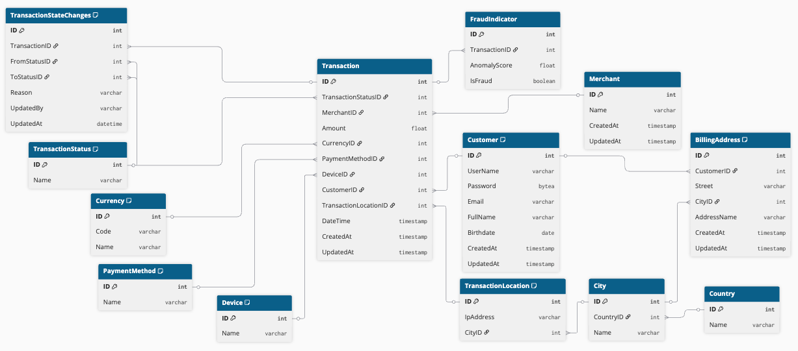

# ERD for OLTP System

## Delivrable description
An Entity-Relationship Diagram showing the normalized schema for the transactional system.

## Task
**OLTP Data Model :**
- Design a normalized schema that supports high-volume transactional processing.
- Ensure the model supports ACID properties and provides mechanisms for real-time data replication and failover.

## Data source
**Transactional Data (OLTP) :**

Captures all financial transactions processed by Stripe.
- Transaction ID
- Merchant ID
- Customer ID
- Transaction Amount
- Currency
- Payment Method
- Transaction Date and Time
- Location (IP-based geolocation)
- Device Type (mobile, desktop, etc.)
- Status (successful, failed, refunded)
- Fraud Indicators (e.g., anomaly scores)

## Normalized schema (3NF)


## Model details

#ACID compliant =>
Example :
```sql
BEGIN;

-- Step 1 : Update the status of a transaction
UPDATE Transaction 
SET TransactionStatusID = 2, UpdatedAt = CURRENT_TIMESTAMP  
WHERE ID = 012345;

-- Step 2 : Insert the status update in the audit log table
INSERT INTO TransactionStateChanges (TransactionID, FromStatusID, ToStatusID, Reason, UpdatedBy, UpdatedAt)
VALUES (012345, 1, 2, "Exceptional refund", "Customer service", CURRENT_TIMESTAMP)

-- Commit the transaction if both steps succeed
COMMIT;

-- Rollback the transaction if an error occurs
ROLLBACK;
```
=> Rajouter delete cascade ?

#Partioning => OK
PARTITION BY RANGE (DateTime);

#Sécurité ( data encryption, role-based access control, and audit logging.) => OK

data encryption (pgcrypto)
```sql
INSERT INTO Customer (UserName, Password, Email, FullName)
VALUES ("John42", crypt("password_john", gen_salt("bf")), "john.doe@stripe.com", "John Doe"); -- Insert the crypted password

SELECT (Password = crypt("password_john", Password)) AS IsGoodPassword FROM Customer ; -- Return true if password match
```
=> permet d'identifier le client (PII : Personal Identifiable Information)

RBAC
CREATE ROLE Admin;
CREATE ROLE Developer;
CREATE ROLE ReadOnlyUser;

GRANT ALL PRIVILEGES ON DATABASE mydb TO Admin;
GRANT SELECT, INSERT, UPDATE, DELETE ON ALL TABLES IN SCHEMA public TO Developer;
GRANT SELECT ON ALL TABLES IN SCHEMA public TO ReadOnlyUser;

technical audit logging
ALTER SYSTEM SET log_connections = 'on';
ALTER SYSTEM SET log_disconnections = 'on';
ALTER SYSTEM SET log_statement = 'all';

Key Security Architecture Principles:

- Three-tier role-based access control - Implement RBAC with defined Admin, Developer, and ReadOnlyUser roles to ensure users receive only the minimum permissions necessary for their organizational functions
- PII data encryption at rest - Deploy pgcrypto to encrypt sensitive personally identifiable information such as customer FullName data, protecting against unauthorized data access even if storage is compromised
- Systematic security auditing - Establish regular security audits and vulnerability assessments including access log reviews, unauthorized access detection, and timely security patch management
- Comprehensive activity monitoring - Implement database monitoring tools to track login attempts, data modifications, and user actions for early detection of suspicious behavior and security threats

#Backup => OK
Full backup every day at midnight : 0 0 * * * /usr/bin/mysqldump -u dbuser -p mydatabase > /backups/mydatabase_$(date +\%F).sql
Updloading backup to AWS S3 : aws s3 cp /backups/mydatabase_$(date +\%F).sql s3://mybucket/backups
Backup restoring : psql -U dbuser -d mydatabase -f /backups/mydatabase_$(date +\%F).sql

Key Backup Architecture Principles:

- Full backup scheduling - Implement scheduled full backups on daily, weekly, and monthly intervals to ensure complete database capture and simplified recovery processes
- AWS S3 cloud storage - Utilize AWS S3 as the primary backup storage solution to provide reliable offsite storage and protect against site-wide disasters
- Process automation - Implement automated backup workflows using cron jobs or DBMS scheduling tools to eliminate human error and ensure consistent execution
- Integrity validation - Establish regular test restore procedures to verify backup validity and confirm successful recovery capabilities
- Tiered retention management - Apply structured retention policies across daily, weekly, and monthly backup cycles to optimize storage costs while maintaining appropriate historical data access