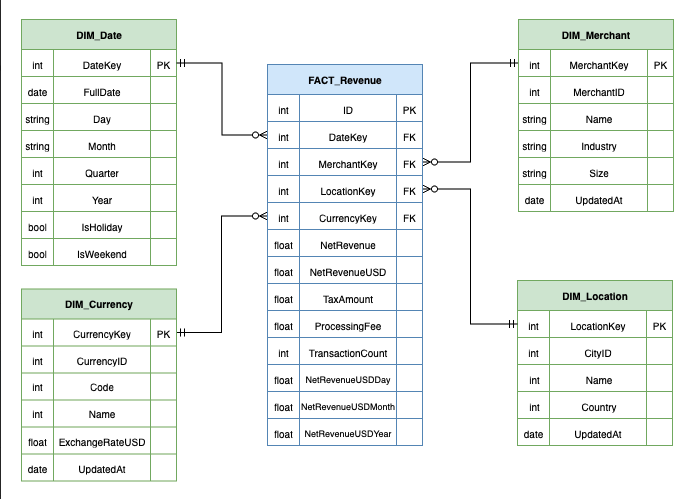
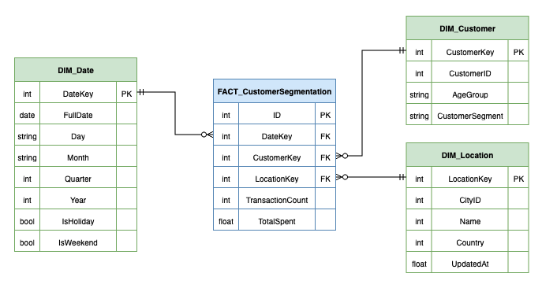
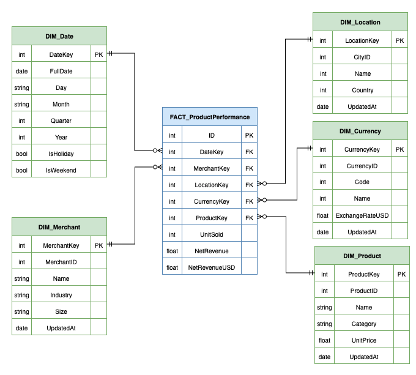
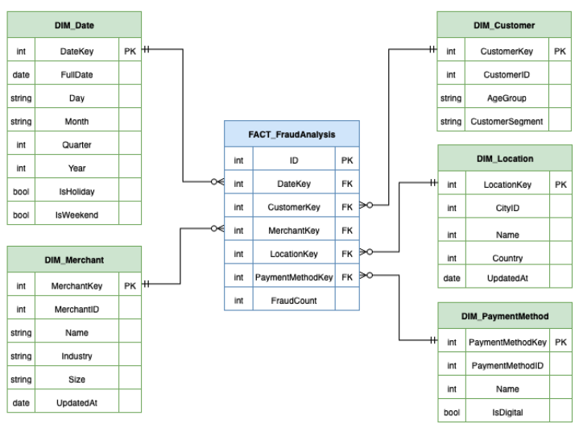

# Schema Design for OLAP System

## Delivrable description
A detailed schema design for the OLAP system, including star or snowflake schemas, aggregation strategies, and query optimization techniques.

## Task
**OLAP Data Model :**
- Design a star or snowflake schema that supports complex queries and aggregations. => OK
- Propose a strategy for handling large-scale joins, subqueries, and time-series analysis. => OK (Dimensions)
- Include a plan for pre-aggregations, materialized views, or summary tables to optimize query performance. => OK (Pre-aggregations directly on FACT tables)

## Data source
**Analytical Data (OLAP) :**

Aggregated and historical data used for reporting and analysis.
- Revenue Metrics (daily, weekly, monthly)
- Customer Segmentation Data
- Product Performance Metrics
- Fraud Analysis Data
- Compliance and Audit Logs

## Star schemas

