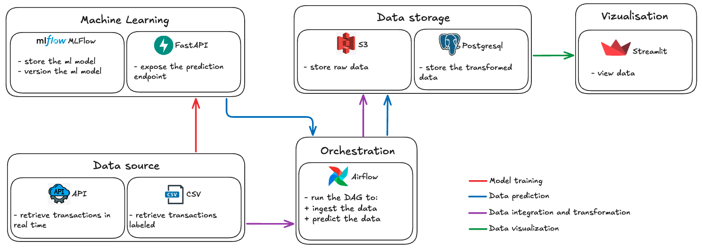

# Automatic fraud detection 🥷🏻

<center></center>

## Description

[ECB](https://www.ecb.europa.eu/press/cardfraud/html/ecb.cardfraudreport202110~cac4c418e8.en.html) is a European institution that defines the broad monetary policy guidelines for the euro area.

In the EU in 2019, the European Central Bank estimated that fraudulent credit card transactions amounted more €1 billion! 😮

AI can really help solve this issue by detecting fraudulent payments in a very precise manner. This usecase is actually now one of the most famous one among Data Scientists.

However, eventhough we managed to build powerful algorithms, the hard thing is now to use them in production. This means predict fraudulent payment in real-time and respond appropriately.

## Architecture



## Demonstration

[Automatic fraud detection demo 🎞️](https://share.vidyard.com/watch/MRVtHzgzC48WmrotJM4Ltg)

## Web pages

[Web dashboard](https://qxzjy-streamlit-fraud-detection.hf.space) (Streamlit)\
[Fraud detection API](https://qxzjy-fastapi-fraud-detection.hf.space/docs) (FastAPI) \
[ML Server](https://qxzjy-mlflow-server.hf.space/#/experiments/8) (MLFlow)

## Getting Started (development environment)

1. Clone the repository

```bash
https://github.com/qxzjy/dsl-ft-32-certification.git

cd dsl-ft-32-certification/BLOCK_3
```

2. Init and launch Airflow

```bash
cd airflow

docker-compose up airflow-init

docker-compose up
```

## Authors

[Maxime RENAULT](https://github.com/qxzjy)