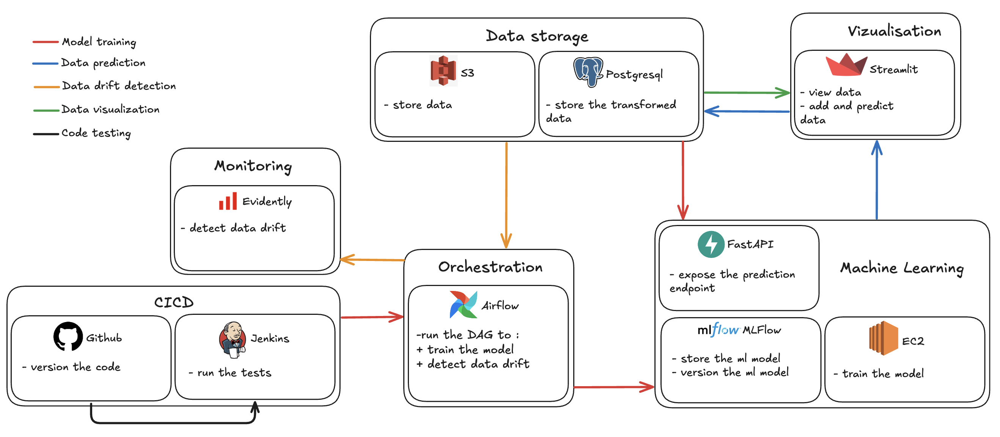

# Est'Immo 🏠

## Description

[Est'Immo](https://qxzjy-streamlit-housing-prices.hf.space/) is a real estate valuation platform.

We were asked to develop an architecture that would enable automatic model ingestion, prediction, and retraining, while ensuring code and data quality through automated testing.

## Architecture



## Demonstration

[Est'immo demo 🎞️](https://share.vidyard.com/watch/k65E1g7K34f9nWBrEE6zjF)

## Web pages

[Web dashboard](https://qxzjy-streamlit-housing-prices.hf.space/) (Streamlit)\
[Fraud detection API](https://qxzjy-fastapi-housing-prices.hf.space/docs) (FastAPI) \
[ML Server](https://qxzjy-mlflow-server.hf.space/#/experiments/10) (MLFlow)

## Getting Started (development environment)

1. Clone the repository

```bash
https://github.com/qxzjy/dsl-ft-32-certification.git

cd dsl-ft-32-certification/BLOCK_4
```

2. Init and launch Airflow 

```bash
cd airflow

docker-compose up airflow-init

docker-compose up
```

4. Open another terminal

```bash
cd <path_to_your_workspace>/dsl-ft-32-certification/BLOCK_4
```

4. Launch Jenkins Docker in Docker

```bash
cd jenkins

docker run -d --name jenkins-docker --rm \
  --privileged --network jenkins --network-alias docker \
  --env DOCKER_TLS_CERTDIR=/certs \
  --volume jenkins-docker-certs:/certs/client \
  --volume jenkins-data:/var/jenkins_home \
  --publish 2376:2376 \
  docker:dind --storage-driver overlay2
```

4. Build the Jenkins image

```bash
docker build -t myjenkins-blueocean:2.504.2-1 .
```

4. Launch Jenkins

```bash
docker run -d --name jenkins-blueocean --restart=on-failure \
  --network jenkins --env DOCKER_HOST=tcp://docker:2376 \
  --env DOCKER_CERT_PATH=/certs/client --env DOCKER_TLS_VERIFY=1 \
  --publish 8090:8080 --publish 50000:50000 \
  --volume jenkins-data:/var/jenkins_home \
  --volume jenkins-docker-certs:/certs/client:ro \
  myjenkins-blueocean:2.504.2-1
```

4. Map NGrock domain to local Jenkins

```bash
ngrok http --url=teal-destined-seemingly.ngrok-free.app localhost:8090
```

## Authors

[Maxime RENAULT](https://github.com/qxzjy)